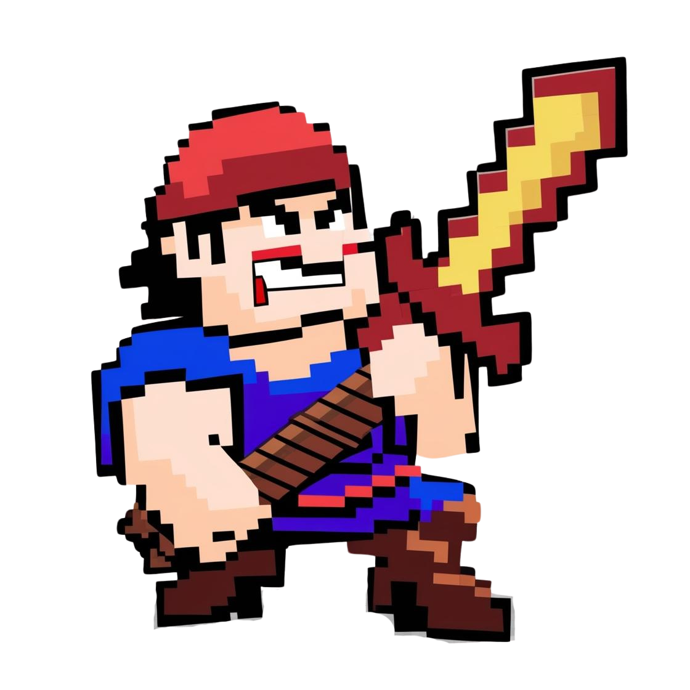
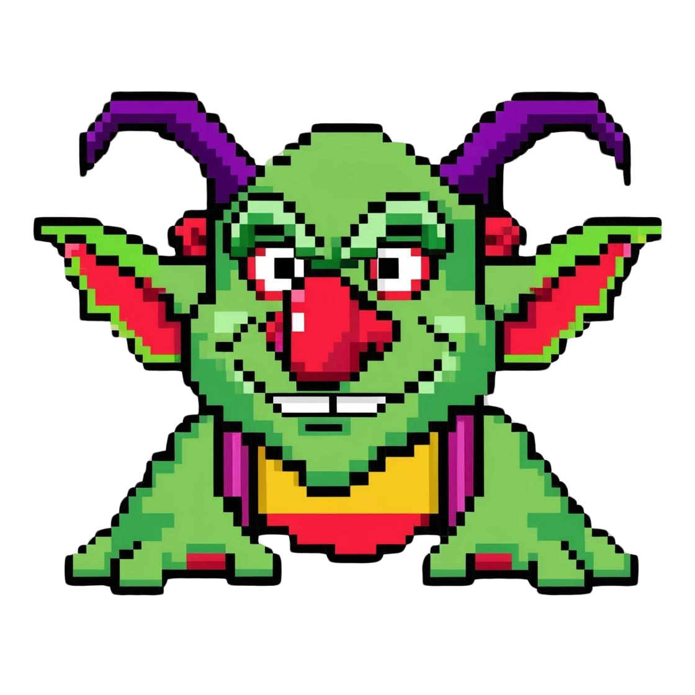
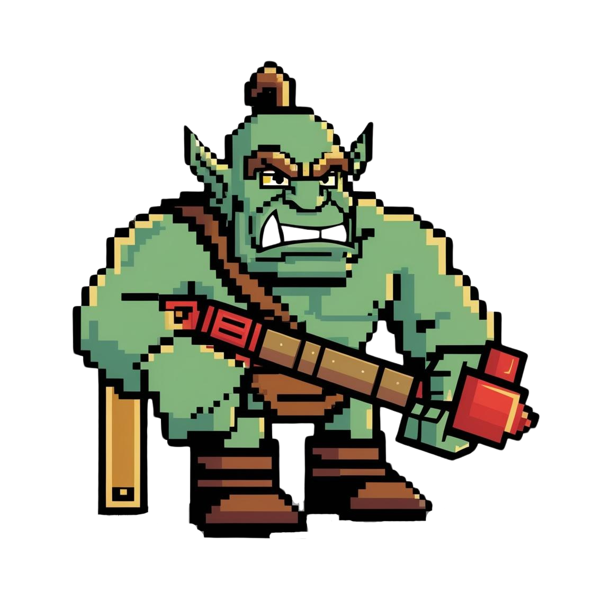
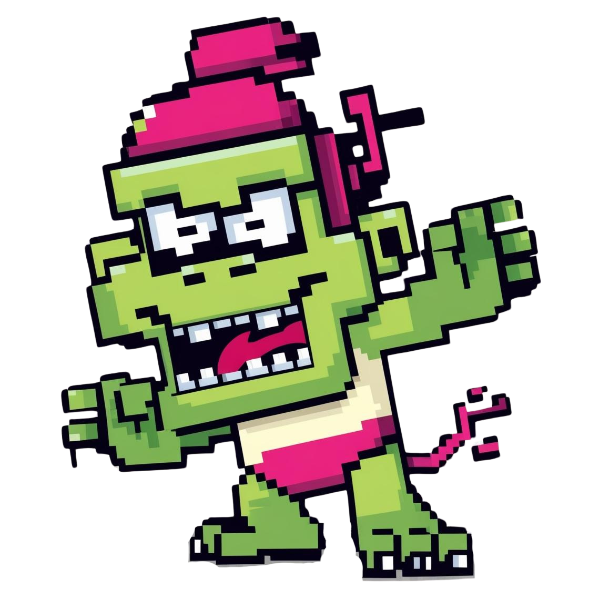

# 🧙‍♀️⚔️ Mini-game: Funny RPG
Um mini-RPG em Python com Pygame, com atmosfera cômica e visual estilo 16-bits, desenvolvido como projeto de aprendizado.
O jogador pode escolher entre as classes Mago ou Guerreiro e enfrentar monstros únicos em caminhos distintos (floresta ou deserto) até o confronto final com o boss ERROR-9090.

---

## 🎮 Sobre o Projeto
Este mini-game foi desenvolvido com foco em aplicar os fundamentos de programação orientada a objetos, lógica de turnos e integração de interface com a biblioteca Pygame.
Foi estruturado para rodar de forma fluida, modular (mesclando projeto visual e terminal) e com uma boa dose de humor sarcástico.

### Características:
- ✅ Lógica de combate com ações: ataque, defesa, cura, erro e crítico
- ✅ Sistema de turnos com falas únicas para cada personagem e inimigo
- ✅ Narração cômica com "Narrador Maluco"
- ✅ Sprites personalizados em 16-bits
- ✅ Trilha sonora e efeitos sonoros
- ✅ Telas visuais em Pygame com botões, hover, balões e seleção de classe
- ✅ Boss final com IA simples e fala dinâmica
- ✅ Modularização em múltiplos arquivos Python: `main.py`, `battle.py`, `player.py`, `monster.py`

---

## 🧠 Aprendizados
- Estruturação de código em camadas: lógica, apresentação e dados
- Uso de herança e polimorfismo com classes customizadas
- Manipulação de eventos e assets gráficos em Pygame
- Lógica de probabilidades e controle de fluxo de turnos
- Coordenação de escopo de projeto real com entrega final funcional

---

## 📂 Estrutura do Projeto
```
ProjetoRPG/
├── main.py              # Menu visual e fluxo de interface
├── battle.py            # Lógica de batalha e introdução
├── player.py            # Classes Mago e Guerreiro
├── monster.py           # Classes de monstros e boss
├── imagens/             # Sprites dos personagens e inimigos
├── musicas/             # Músicas e efeitos sonoros
└── README.md
```

---

## 🖼️ Capturas








---

## 🚀 Execução
Para rodar o jogo:
```bash
python main.py
```

> Requisitos:
> - Python 3.x
> - Pygame (`pip install pygame`)

---

## ✨ Créditos
Este projeto foi originalmente pensado como trabalho em grupo, mas todo o escopo funcional, visual e narrativo foi coordenado, programado e apresentado por mim, como exercício de aprendizado e superação de limites técnicos.

---

## 🌎 English Summary
> Independently developed a turn-based mini-RPG in Python using Pygame, featuring:
> - Turn logic with attack, defend, heal, and error chance;
> - Interactive UI with buttons, dialogues and narrator;
> - Custom 16-bit sprites and background music;
> - Full modular architecture across multiple files;
> - Humor-infused storytelling and boss battle.

---

## 📫 Contato

Caso tenha interesse em projetos semelhantes ou oportunidades na área de desenvolvimento, estou disponível para contato!  
**GitHub**: https://github.com/thuanisc
**LinkedIn**: https://linkedin.com/in/thuanisc
